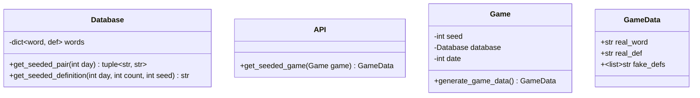

```mermaid
classDiagram

class Database {
    -dict~word, def~ words

    +get_seeded_pair(int day) tuple~str, str~
    +get_seeded_definition(int day, int count, int seed) str
}

class API {
    +get_seeded_game(Game game) GameData
}

class Game {
    -int seed
    -Database database
    -int date

    +generate_game_data() GameData
}

class GameData {
    +str real_word
    +str real_def
    +~list~str fake_defs
}


```